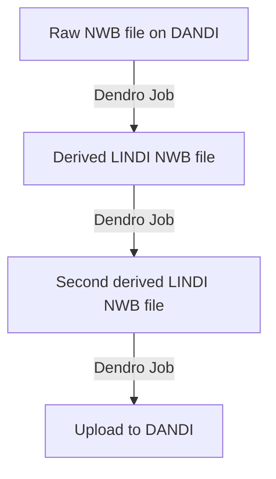

# Leveraging LINDI for efficient and non-redundant NWB access on DANDI

INCF Neuroinformatics Assembly, September 26, 2024

Jeremy Magland, Center for Computational Mathematics, Flatiron Institute

With Ryan Ly and Oliver Ruebel

Thanks: NWB team, DANDI team, CatalystNeuro

## LINDI Objectives

LINDI (LINked Data Interface) sets out to solve two challenges for NWB data on DANDI:

* Efficient streaming of NWB into visualization tools and processing pipelines
* Creation of derivative NWB files without duplicating data

## What is a LINDI file?

[Get the details here.](https://github.com/neurodatawithoutborders/lindi)

LINDI

* Cloud-friendly format for representing NWB data
* Compatible with HDF5 - you can read/write it with h5py and pynwb
* Separates metadata from binary data - inspired by kerchunk
* Three formats: .nwb.lindi.json, nwb.lindi.tar, and .nwb.lindi.d

## Deep dive into the JSON format

LINDI JSON contains:
* HDF5 group/dataset hierarchy
* Group attributes
* Dataset attributes, shape, data type, chunking information, compression information
* Base64-encoded binary data for small datasets.

It does not contain:
* Large binary dataset chunks.

Essentially it contains as much information as possible without the large binary data.

Advantages of JSON over HDF5:
* Human-readable
* Broadly compatible with many programming languages

Advantages of leaving out large binary data:
* Smaller file size
* Faster to load

[Here's an example .nwb.lindi.json file](https://lindi.neurosift.org/dandi/dandisets/000458/assets/db2372af-f041-42c8-a5f1-594be5a83c9e/nwb.lindi.json)

If you are familiar Zarr, you'll recognize the .zattrs, .zgroup, .zarray, and chunk files. That's because LINDI is a valid Zarr store!

Here's an excerpt from this .nwb.lindi.json file:

```json
{
    "acquisition/ElectricalSeriesEEG/.zattrs": {
      "comments": "no comments",
      "description": "voltage measured over time and associated timestamps from EEG array",
      "namespace": "core",
      "neurodata_type": "ElectricalSeries",
      "object_id": "7e71efad-e026-459c-8a01-5a6e61fa4214"
    },
}
```

You'll see that the content of the .zattrs Zarr file is embedded in the JSON file.

Similarly for .zarray files:

```json
{
    "acquisition/ElectricalSeriesEEG/data/.zarray": {
      "chunks": [ 83835, 1 ],
      "compressor": null,
      "dtype": "<i2",
      "fill_value": 0,
      "filters": [ { "id": "zlib", "level": 4 } ],
      "order": "C",
      "shape": [ 21461760, 30 ],
      "zarr_format": 2
    }
}
```

The tricky part is the data chunks (this is inspired by Kerchunk and the reference file system of fsspec).

```json
{
    "acquisition/ElectricalSeriesEEG/timestamps/1015": [
      "https://api.dandiarchive.org/api/ dandisets/000458/ versions/0.230317.0039/assets/ db2372af-f041-42c8-a5f1-594be5a83c9e/download/",
      960839955,
      51593
    ],
}
```

This is an external reference to a chunk of data in a remote file. In this case we are looking at th 1015<sup>th</sup> chunk of the timestamps dataset in the ElectricalSeriesEEG group, and it is referring to 51,593 bytes of data starting at byte 960,839,955 in the remote HDF5 file.

## If LINDI is Zarr, how does it represent HDF5?

Zarr and HDF5 are both hierarchical data formats, but they differ in some important ways:

| HDF5 | Zarr | Compatibility notes |
|------|------|----------------------|
| Groups | Groups | Compatible |
| Datasets | Arrays | Compatible |
| Scalar datasets | No direct equivalent | Not compatible |
| Attributes | Attributes | Largely compatible with some caveats |
| Chunking | Chunking | Largely compatible, default chunking is different |
| Compression | Compression | Compatible for the most usual cases, but Zarr allows custom compressors via numcodecs |
| Datatypes | Datatypes | Compatible for the most common cases (int16, uint16, int32, uint32, float32, float64, etc.) |
| References | No direct equivalent | Not compatible |
| Soft links | No direct equivalent | Not compatible |
| Compound datatypes | No direct equivalent | Not compatible |

LINDI contains special conventions for representing some HDF5 features used by NWB that are not directly compatible with Zarr.

For example, in the above .nwb.lindi.json file:

```json
{
    ".zattrs": {
      ".specloc": {
        "_REFERENCE": {
          "object_id": null,
          "path": "/specifications",
          "source": ".",
          "source_object_id": "9adc2c77-b588-4966"
        }
      },
      "namespace": "core",
      "neurodata_type": "NWBFile",
      "nwb_version": "2.5.0",
      "object_id": "9adc2c77-b588-4966-b630-0d12c3059156"
    }
}
```

## Precomputation of LINDI files for public Dandisets

Neurosift uses precomputed LINDI files to efficiently stream NWB files from public Dandisets.


## Neurosift load times with and without LINDI

Compare Neurosift load speeds with and without precomputed LINDI files for Danidset 000458:

* [Without precomputed LINDI](https://neurosift.app/?p=/nwb&url=https://api.dandiarchive.org/api/assets/db2372af-f041-42c8-a5f1-594be5a83c9e/download/&dandisetId=000458&dandisetVersion=draft&lindi=0) (~ 6 second load time)
* [With precomputed LINDI (the default)](https://neurosift.app/?p=/nwb&url=https://api.dandiarchive.org/api/assets/db2372af-f041-42c8-a5f1-594be5a83c9e/download/&dandisetId=000458&dandisetVersion=draft) (~ 1 second load time)

## Python streaming with and without LINDI

There are a number of ways to stream NWB files in Python. Here are four examples:

```python
# Precomputed LINDI (fast)
def stream_nwbfile_lindi_precomputed(nwb_url: str):
    file = lindi.LindiH5pyFile.from_lindi_file(nwb_url)
    io = NWBHDF5IO(file=file, load_namespaces=True)
    nwbfile = io.read()
    return nwbfile, io

# HDF5 via lindi (medium)
def stream_nwbfile_lindi(nwb_url: str):
    file = lindi.LindiH5pyFile.from_hdf5_file(nwb_url)
    io = NWBHDF5IO(file=file, load_namespaces=True)
    nwbfile = io.read()
    return nwbfile, io

# HDF5 via remfile (medium)
def stream_nwbfile_remfile(nwb_url: str):
    file = remfile.File(nwb_url)
    h5f = H5pyFile(file, mode="r")
    io = NWBHDF5IO(file=h5f, load_namespaces=True)
    nwbfile = io.read()
    return nwbfile, io

# HDF5 via fsspec (slow)
def stream_nwbfile_fsspec(nwb_url: str):
    fs = filesystem("http")
    file_system = fs.open(nwb_url, "rb")
    file = H5pyFile(file_system, mode="r")
    io = NWBHDF5IO(file=file, load_namespaces=True)
    nwbfile = io.read()
    return nwbfile, io
```

The timings are compared for the Dandiset 000485 example using [this script](https://github.com/magland/nwb_streaming_benchmark/blob/main/main.py).

[Here are the results](https://github.com/magland/nwb_streaming_benchmark/blob/main/output.txt) produced by a GitHub Actions workflow.

On 9/23/2024 for the 000485 example, the average elapsed times were:

|Method|Average elapsed time (s)|
|------|------------------------|
|lindi precomputed|1.23|
|remfile|2.79|
|lindi|2.81|
|fsspec|14.96|
|ros3|Not tested|

Here, the precomputed LINDI method is the fastest, followed by the remfile and lindi methods, and the fsspec method is the slowest.

Note that this is only for the initial load of the NWB file. Subsequent access to data chunks may be more comparable between the methods.

## Derivative NWB files with LINDI



**CEBRA example, Dandiset 000140**

[CEBRA](https://cebra.ai/) is a machine-learning method that can be used to compress time series in a way that reveals otherwise hidden structures in the variability of the data.

Let's take a look at

> [Dandiset 000140](https://dandiarchive.org/dandiset/000140/draft) -- MC_Maze_Small: macaque primary motor and dorsal premotor cortex spiking activity during delayed reaching

[Open one of the sessions in Neurosift](https://neurosift.app/?p=/nwb&url=https://api.dandiarchive.org/api/assets/7821971e-c6a4-4568-8773-1bfa205c13f8/download/&dandisetId=000140&dandisetVersion=draft)


We've got a trials table (100 trials), three SpatialSeries objects (cursor_pos, eye_pos, hand_pos), and 142 neural Units.

Click on the "Units" link and then the "CEBRA" tab. Here you can queue up a job to compute a CEBRA embedding for the neural activity.


This produces a new NWB file with the CEBRA embedding added on as a new TimeSeries object. Click on the "View output in Neurosift" link to [view the output file](https://neurosift.app/?p=/nwb&url=https://tempory.net/f/dendro/f/hello_world_service/hello_cebra/cebra_nwb_embedding_6/vHYko5zHCG6GPwBx1N6B/output/output.nwb.lindi.tar&dandisetId=000140&dandisetVersion=draft&st=lindi).


Notice there is a new object at processing/CEBRA/embedding.

Tick the checkboxes for "trials and "embedding" and then click "View 2 items" in the left panel to get a synchronized view of the trials and the CEBRA embedding.


You can see that the embedding has periodic structure that matches the trial structure! This is significant because in this case we did not provide the trial structure or the behavioral data to the CEBRA process. It was able to infer the trial structure from the neural data alone.

## LINDI binary (tar) format

That previous example was a .nwb.lindi.tar file, instead of a .nwb.lindi.json file. This is needed when we are writing new large data blobs into the derived file, as the JSON format is not suitable for large binary data.

Read more about the [LINDI tar format here](https://github.com/NeurodataWithoutBorders/lindi/blob/main/README.md) with the [technical specification here](https://github.com/NeurodataWithoutBorders/lindi/blob/main/docs/tar.md).

## Derivative NWB files on DANDI

**Right now DANDI does not support the LINDI format,** but I am hoping that they can move toward supporting it. This presentation I hope will begin to make the case.

For now I am uploading test LINDI files to the staging DANDI Archive.

Let's return to the [above example](https://neurosift.app/?p=/nwb&url=https://tempory.net/f/dendro/f/hello_world_service/hello_cebra/cebra_nwb_embedding_6/vHYko5zHCG6GPwBx1N6B/output/output.nwb.lindi.tar&dandisetId=000140&dandisetVersion=draft&st=lindi). Click on the DENDRO tab and you can see a button for uploading to the DANDI staging archive.


You can see the [uploaded file on DANDI here](https://gui-staging.dandiarchive.org/dandiset/213569/draft/files?location=000140&page=1).


## Spike sorting example

Here's an example of a [derivative NWB file produced by a spike sorting process](https://gui-staging.dandiarchive.org/dandiset/213569/draft/files?location=000409%2Fsub-CSHL045&page=1).


Notice that the file size is only 11 MB even though it contains references to the full raw data with a size of 69 GB.

Open in Neurosift and you can see the spike sorting results in processing/ecephys -> units_kilosort4. This is in addition to the original spike trains in the units table at the default location.


You can view the raster plot, average waveforms, autocorrelograms, and unit locations. Here's a synchronized view of average waveforms and autocorrelograms.


## Concerns and considerations

**Keeping LINDI references alive**

Derivative NWB files in LINDI format may reference other DANDI assets. We need a mechanism for only allowing references to published assets. Drafts can depend on drafts, but published should depend on published. Will need to think about how this will work.

**Should we really use a new file format?**

Keep in mind that LINDI is compatible with:​
* NWB​
* HDF5​ (via h5py)​
* Zarr​
* Reference file system of fsspec / kerchunk​

No existing tool enables what we are trying to do.
